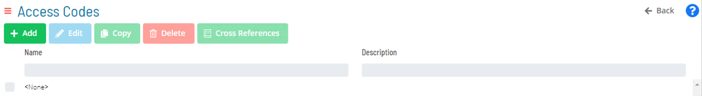
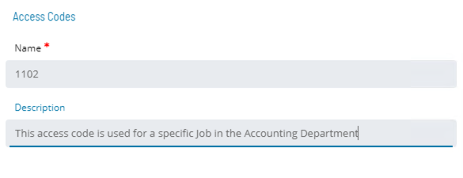

# Access Codes

## Overview

* Access Codes can be used to secure individual Job records 
* To make use of an Access Code, Privileges must be granted 
* A single Access Code can be used to secure as many different Jobs as necessary

### Access Code Privileges

* To implement Access Codes for securing Jobs, each User must have appropriate Access Code Privileges through one or more Roles to view and update Jobs
* ```<None>``` is the default Access Code for all Jobs
    * All Roles automatically have Privileges to update any Jobs with ```<None>``` Access Code
* When additional Access Codes are created, the Administrator must grant Privileges for Access Codes to the appropriate Role Name

* In Solution Manager, **Access Codes** is found in **Library > Security > Access Codes**

### Add Access Code






### For More Information

**[Access Codes - Overview](https://help.smatechnologies.com/opcon/core/objects/access-codes)**

**[Access Codes - Solution Manager Interface](https://help.smatechnologies.com/opcon/core/Files/UI/Solution-Manager/Library/AccessCodes/)**