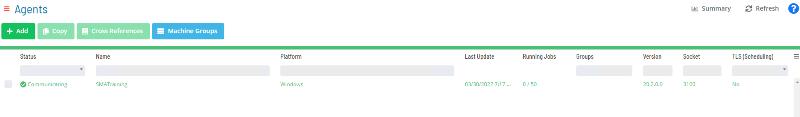
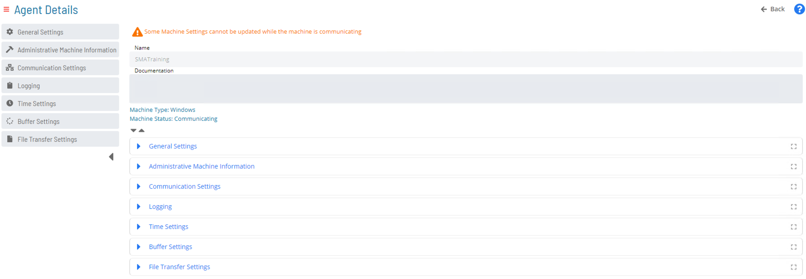

# Agents/Machines

In OpCon, a **Machine** is a representation of an Agent **(LSAM)** - **LOCAL SCHEDULE ACTIVITY MONITOR**  in the OpCon database.

- All systems with an LSAM installed must be defined as a machine in the OpCon database
  - Once a machine is defined in the database, the SAM and supporting services can begin scheduling jobs on it
- The LSAM/Agent listens for commands from OpCon’s main engine to kick off and monitor specified tasks
- Machines define where a task will be run

#### Machine Status

- **Machine Status** displays the Connection Status of all Machines configured in the OpCon database
  * Displayed in Grid format
  * Status can be updated from this screen

### Agent List Screen

### Agent Details

### Machine Groups

A **machine group** displays the user-defined machines with common characteristics and usage. All machines in a group must have a common operating system. Additionally, all machines in a group must have the same data structure for their jobs (i.e., all must be using either Non-XML or all must be using XML).

The following information applies to defining machine groups:

* **Name:** Defines the name for the machine group.
* **Machine OS Type:** Defines the OS Type for the machine group.
* **Description:** Provides an area for descriptions, explanations, and notes that can be updated for the defined machine group. in the Enterprise Manager online help.
* **Machine Assignment:** Defines all assigned machines for the defined machine group. Machines in the group must have matching operating systems and communication protocols.

### Practice Activity

<a class="button button--link button--block button--primary" href="practice-create-a-machine">Create a Machine</a>

**<a href="practice-create-a-machine" target="_blank">Create a Machine</a>**

### For more information

The links below provide concept documentation for creating and using Machines in OpCon.

**[Machines](https://help.smatechnologies.com/opcon/core/objects/machines)**

**[Managing Agents](https://help.smatechnologies.com/opcon/core/Files/UI/Solution-Manager/Managing-Agents)**

**[Performing Agent Status Updates](https://help.smatechnologies.com/opcon/core/Files/UI/Solution-Manager/Performing-Agent-Status-Updates)**

**[Machine Groups](https://help.smatechnologies.com/opcon/core/Files/UI/Solution-Manager/Library/MachineGroups/)**

