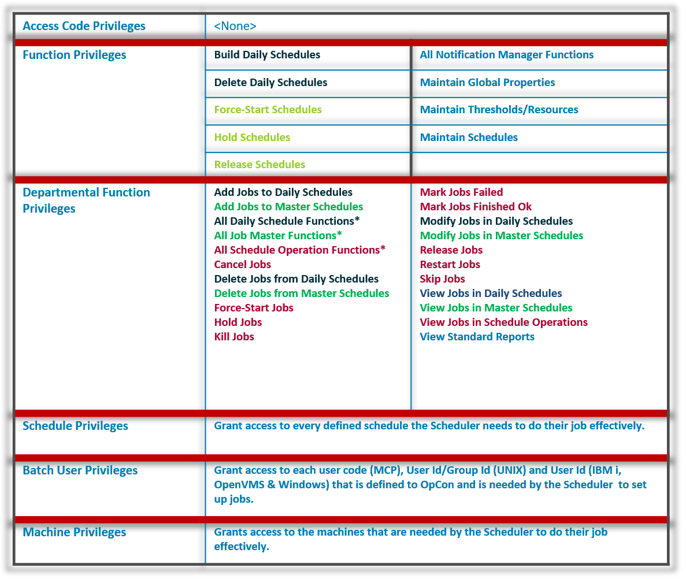
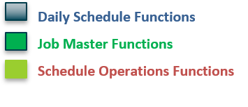

# Common Role Configurations

### Best Practices

* Three main user Groups (Roles) For OpCon Privileges:  
    * **Administrators**
    * **Schedulers**
    * **Operators**

#### Administrators

* OpCon Administrator(s) must ensure all OpCon Users have needed Privileges 
* The OpCon Administrator with the User ID ```ocadm``` is automatically granted all Privileges to everything within OpCon, **including** access to ‘Server Options’ and the ability to edit Schedule or Job Frequencies affecting multiple Jobs
* When creating new Administrator User accounts, desired Privileges must be purposefully selected

#### Schedulers

* These individuals will build and maintain Jobs and Schedules 
* They will need as much access as possible to every section within Enterprise Manager except for ‘Administration’ section 
* Privileges listed in chart can be used as a guide for assigning Privileges to OpCon Schedulers





#### Operators

* These individuals will monitor Jobs and Schedules on daily basis 
* They will need authority to see every Schedule and be able to perform maintenance before and after a Job and/or Schedule runs (Restart Jobs, Force-Start Jobs, Force-Start Schedules, Release Schedules, etc.) 
* Privileges listed in the chart can be used as a guide for assigning Privileges to OpCon Operators


