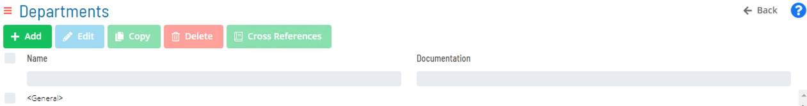
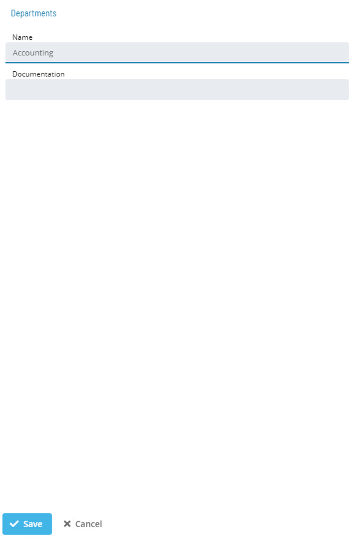
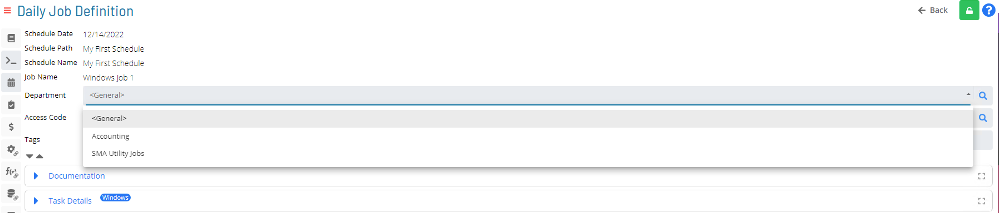

# Departments

* Secure Function Privileges associated with individual Job records
* To make use of the Department category, Function Privileges must be granted, and Access Code must be associated with Jobs needing this type of security 
* A single Department can be used to secure as many different Jobs as necessary

_Three Steps to setting up Departments in OpCon_:  

* Create a Department
* Assign Department Function Privileges to a Department 
* Assign a Department to any Job which requires those Department Function Privileges (**Job Master**)
* Only required field is **Name**  
* Using Documentation field for Department rationale is best practice

### Departmental Function Privileges

* **Departmental Function Privileges** are used to grant operational Privileges related to Jobs
* Departmental Function Privileges can be filtered by Department:
    * All Departments
    * ```<General>``` Department
    * User Defined Departments
* When some Privileges are granted, the selected Role must also have ‘additional’ Function Privilege(s) granted
    * Example: A Role that is granted the **Add Jobs to Daily Schedules** Privilege must also be granted the **View Jobs in Daily Schedules** and the  **View Jobs in Master Schedules** Privileges to perform this function

### Departments in Master Jobs

* A Department is assigned to Jobs in Job Details tab of Job Master
* A Job can only be assigned to **one** Department
* Default Department is ```<General>```


* In Solution Manager, **Departments** is found in **Library > Security > Departments**

### Create or Select a Department



### Create Department



### Department in Job Details



### For More Information

**[Departments](https://help.smatechnologies.com/opcon/core/objects/departments)**

**[Roles - Department Activities](https://help.smatechnologies.com/opcon/core/Files/UI/Solution-Manager/Library/AccessManagement/Roles/Modifying-Roles-And-Privileges/Department-Activities)**
