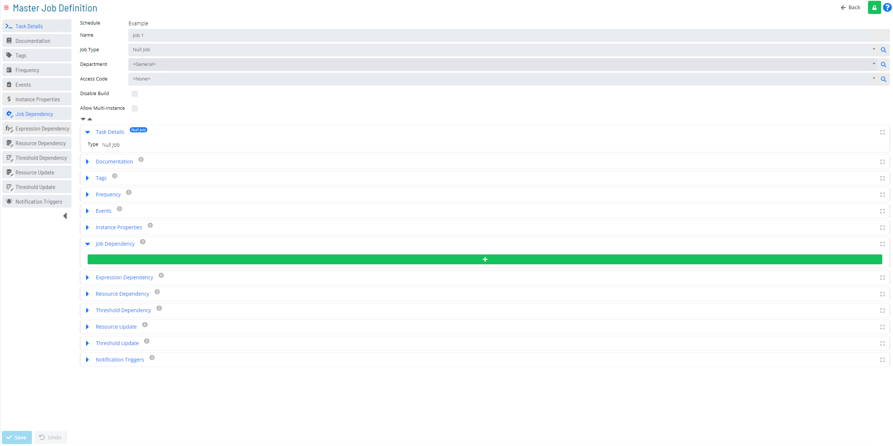

# Job Dependencies

### Job Dependencies in Job Definition

OpCon utilizes **Dependencies** to define the run sequence of a process.

**Dependencies** are defined in the **Master Job Definition** under the **Job Dependency** section.

### Job Dependency Types

* **Requires** – The selected Job is required to exist and be in completed status before a dependent Job will run (default requires successful completion)
* **After** – The selected Job must be in completed status before a dependent Job will run **IF** it exists (default requires successful completion)
* **Excludes** – The selected Job will be removed from the Schedule on days the dependent Job is scheduled
* **Conflict** – Dependent Job will not start if the selected Job is currently running

### Job Dependency Conditions

#### Finished OK

* When used with **Requires** or **After** the dependency line is in **Green**
* **Finished OK** option is valid for either the **Requires** or **After** Dependency Type
* If selected, the previous Job will need to have finished successfully before other Jobs can run.

#### Failed

* When used with **Requires** or **After** the dependency line is in **Red**
* **Failed** option is valid for either the **Requires** or **After** Dependency Type
* If selected, will allow the previous Job to fail then process other Jobs that are part of that path

#### Ignore Exit Code

* When used with **Requires** or **After** the dependency line is in **Black**
* **Ignore Exit Code** option is valid for either a **Requires** or a **After** Dependency Type
* If selected, the option will allow a selected Job to run once the Dependent Job is complete regardless of Exit Code status

### Additional Settings

#### Job Dependency - **Offset**

* Allows Cross Day Dependencies
* Uses Physical Day instead of Working Day by default
  * Unless the Job Dependency Offset Type in Server Options is set to **Occurrence** instead of default of **Calendar Days**

#### Job Dependency - **Based on Frequency**

* Allows a Dependency to be set only when the Job is built using a specific Frequency 
  * If no Frequency is selected, the Dependency is always true
  * Used in place of After Dependency

### Schedule Dependency Setting

#### Conflicts with other days

* Prevents a Schedule from opening until all Daily instances of that Schedule from previous days are complete
* Use **Late to Start** notices if this parameter is used

### Practice Activity

**<a href="practice-create-a-job-dependency" target="_blank">Practice - Create a Job Dependency</a>**

### For More Information

**[Job Dependencies Documentation](https://help.smatechnologies.com/opcon/core/job-components/job-dependencies)**

**[Viewing and Updating Job Dependencies Documentation](https://help.smatechnologies.com/opcon/core/Files/UI/Solution-Manager/Library/MasterJobs/Viewing-And-Updating-Master-Jobs/Viewing-And-Updating-Job-Dependencies)**

