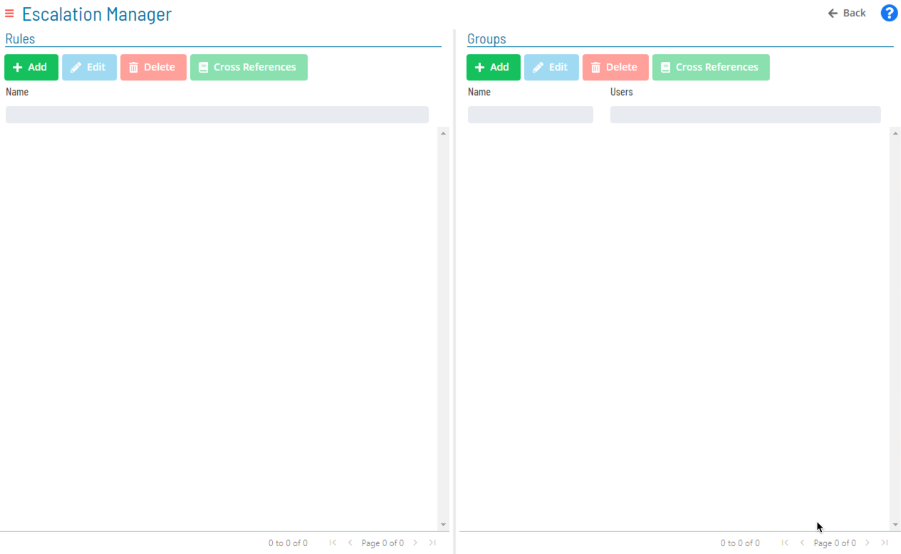
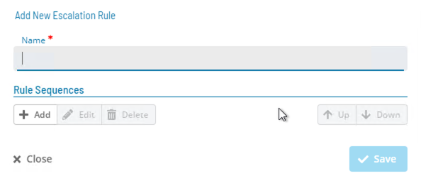
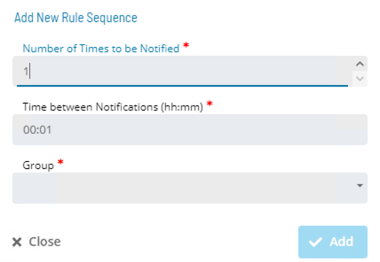

# Escalation Manager

* Allows users to create Escalation Rules which will be tied to Notifications
* Escalation Rules are tied to Notifications setup in Notification Manager
* **Groups** must be created **BEFORE Rules**

### Groups

* Groups specify who will be tied to a Notification
* Email address is gathered from the User Account screen
* Specifies who can acknowledge an Escalated Notification

### Global Property

* A Global Property can have OpCon automatically update which users are tied to group

### Rules

* Escalation Rules lists:
    * Which group will be alerted
    * Number of alerts before escalating
    * Minutes between alerts
* Multiple Groups can be listed to elevate alerts after a configured number of Notifications

### Escalation Rule

* Tie Escalated Notifications within Notification Manager
* Only one Escalation Rule can be set up per Notification
* Escalation Rules can only be set to emails at this time

### Practice Activity

**<a href="practice-escalation-manager" target="_blank">Escalation Manager</a>**

### For More Information

**[Escalation](https://help.smatechnologies.com/opcon/core/notifications/Escalation)**

**[Notification Trigger](https://help.smatechnologies.com/opcon/core/notifications/Notification-Triggers)**

**[Notification Configuration](https://help.smatechnologies.com/opcon/core/notifications/Notification-Configuration)**

**[Managing Escalation Manager](https://help.smatechnologies.com/opcon/core/Files/UI/Solution-Manager/Library/EscalationManager/Escalation-Manager)**

**[Managing Escalation Rules](https://help.smatechnologies.com/opcon/core/Files/UI/Solution-Manager/Library/EscalationManager/Managing-Escalation-Rules)**

**[Managing Escalation Groups](https://help.smatechnologies.com/opcon/core/Files/UI/Solution-Manager/Library/EscalationManager/Managing-Escalation-Groups)**

