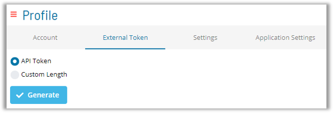

# Events

* OpCon Events execute commands within OpCon
* Events can be defined to execute upon:
    * Schedule Completion
    * Job Statuses
    * String Match on LSAM Feedback for Jobs
    * Job Exit Description
    * Event Triggers from Notification Manager
    * External Events

* Almost any action within OpCon can be handled by Events
* Partial list of Event types:
    * CALENDAR
    * CONSOLE
    * JOB (Daily)
    * JOBMASTER (Master)
    * MACHINE
    * NOTIFY
    * PROPERTY
    * RESOURCE
    * SCHEDULE
    * THRESHOLD

### Internal vs External Events

* Internal Events created from Enterprise Manager/Solution Manager (Self-Service)
    * Events tab in Schedule/Job Master
    * Event notification trigger in Notification Manager
    * Events assigned to buttons within Self-Service/Solution Manager
    * Internal Events are authenticated through User Account which created Event in Enterprise Manager

* External Events
    * Anything that can generate a text file with Event syntax can interact with OpCon through an external hook called MSGIN
    * SMA Examples: SMAResource Monitor, SMArt Email, SMAParseFile

:::note
External Events must be authenticated with an **OpCon Username** and an **External Event Password** or **Token**
:::

### External Event Tokens

:::note
Beginning with OpCon 20.0 - External Event Passwords must be created by generating an ```External Token``` in the Enterprise Manager **Password Update** Menu OR in the ```External Token``` Tab of the User Profile topic in Solution Manager

* Legacy External Event Passwords will still be active within existing systems but must be replaced with an ```External Token``` when a Password change is required
:::

### Generate External Token



### Events Documentation

[Job Components - Events](https://help.smatechnologies.com/opcon/core/job-components/events)

[OpCon Events](https://help.smatechnologies.com/opcon/core/events/introduction)

[Event Types List](https://help.smatechnologies.com/opcon/core/events/types)

### Practice

<a href="practice-create-an-event" target="_blank">Practice - Create an Event</a>