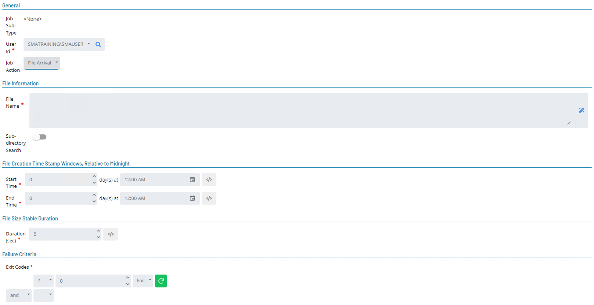
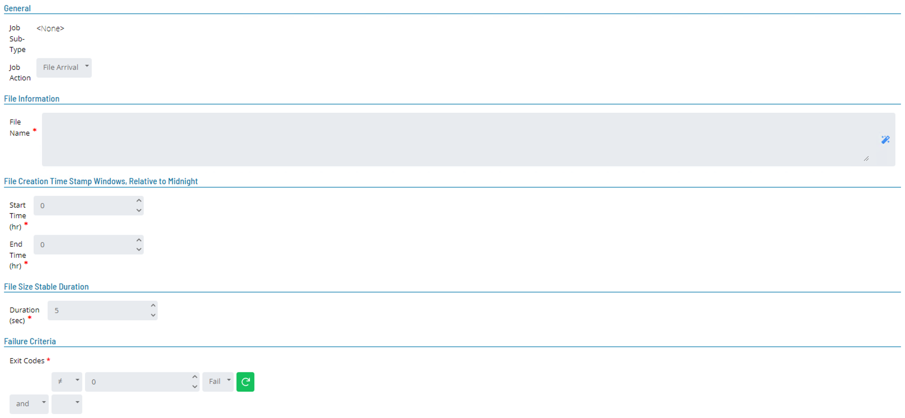

# File Arrival

The Windows and Unix Agents support the **File Arrival** job type. The File Arrival job type utilize the **Integrated File Watcher Job** which is supported both Windows and UNIX agents. 

Supported File Arrival features include:

* Watching for a specific file name, a file name with wildcards, or a UNC path name.
* Watching sub-directories.
* Watching for a file's creation stamp to be within a specific time frame.
* Watching for a file's size to be stable for a specific amount of time before reporting the file's successful arrival.
* Using tokens for the time frame and stable time.
* Defining advanced failure criteria.

### Windows File Arrival Jobs

* Windows standard wildcards allowed in file name
* Use Properties in Path if needed
* Windows File Arrival Jobs can utilize Advanced Failure Criteria

### UNIX File Arrival Jobs

* UNIX standard wildcards allowed in file name
* Use Properties in the Path if needed

* File Arrival Job finishes OK
  * Fails if file does not arrive in Time Stamp Window
* LSAMs (Windows and UNIX) set some Properties for that Job
  * Work as Job Instance Properties for File Arrival Job:

### File Arrival Properties

:::note
The file being searched in the table below for by the File Arrival job resides in **"D:\NewFiles\File123456789.txt"**
:::

| Property Name | Description | Example |
| --- | --- | --- |
| JI.$ARRIVED BASE FILE NAME | Resolves to the file found by the File Arrival job. | File123456789 |
| JI.$ARRIVED FILE EXTENSION | Resolves to the extension of the file found by the File Arrival job. | .txt |
| JI.$ARRIVED FILE NAME | Resolves to the directory path and file name of the file found by the File Arrival job. | D:\NewFiles\File123456789.txt |
| JI.$ARRIVED FILE PATH | Resolves to the directory path of the file found by the File Arrival job. | D:\NewFiles |
| JI.$ARRIVED SHORT FILE NAME | Resolves to the file name and extension of the  found by the File Arrival job. | File123456789.txt |

:::tip Example
* Receive 5 files and all should be processed the same way
* Order of file processing does not matter
* Set up:
	* A Main Schedule
		* With File Watcher, using wild card(s) to capture file name
		* A Job must also be added that will create files in Main Schedule
	* When a File Arrival job finds a match (after the Create File Job runs), the Event is triggered
		* The Event adds a Multi-Instance Container Job that calls the processing SubSchedule
		* Once the Container Job finishes, it triggers the  Event to restart the File Watcher  
			* This will loop through all 5 files
:::

### File Arrival Documentation

[File Arrival](https://help.smatechnologies.com/opcon/agents/windows/advanced-features/file-arrival)

[Defining Job Action: File Arrival Job Details](https://help.smatechnologies.com/opcon/core/Files/UI/Enterprise-Manager/Job-Type-Management/#defining-job-action-file-arrival-job-details-1)

[Fields for Windows File Arrival](https://help.smatechnologies.com/opcon/core/job-types/windows#fields-for-file-arrival)

[UNIX File Activity Detection Daemon](https://help.smatechnologies.com/opcon/agents/unix/daemon/file-activity-detection-daemon)

### Practice

<a href="practice-file-arrival" target="_blank">Practice - File Arrival</a>
