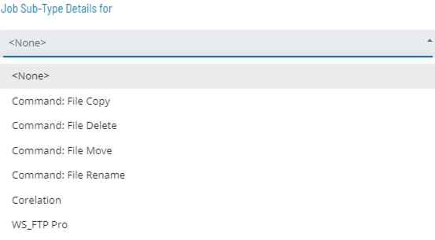

# Windows File Movement Job Sub-Type

* OpCon brings some special **Job Sub-Types** related with file maintenance
* Windows Job Sub-Types simplify the Job definition process by displaying fields to generate Command Line for programs commonly used by SMA customers

* The most common File Movment **Windows Job Sub-Types** are:
	* **File Copy** -  Copies files from one place to another
	* **File Move** - Moves files from one place to another
	* **File Rename** - Renames a file
	* **File Delete** - Delete files

 

### File Movement Documentation

[Windows Job Sub-Types](https://help.smatechnologies.com/opcon/core/job-types/windows#windows-job-sub-types)

[Defining Command: File Job Types](https://help.smatechnologies.com/opcon/core/Files/UI/Enterprise-Manager/Job-Type-Management/#defining-command-file-copy-job-details)