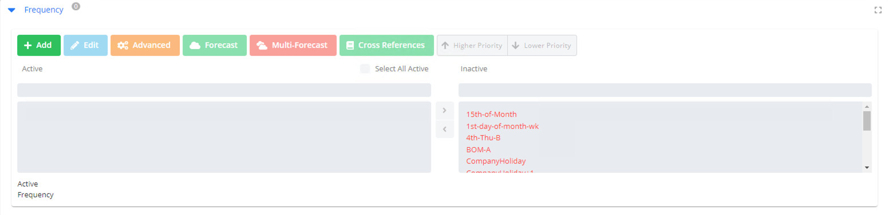
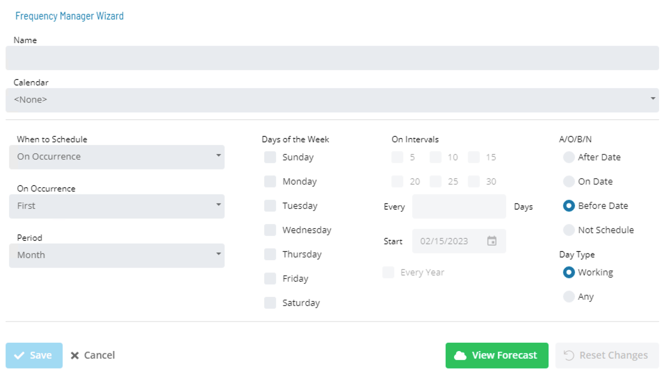

# Frequencies

### Frequency Definition

* In Solution Manager, a **Frequencies List** is found in **Library > Management > Frequencies**

* Frequencies can be edited by selecting a Frequency from the **Frequencies List** and clicking the **Edit** button

* Frequency details for a Job can be viewed in the Daily Job Definition

* Frequencies reference two settings from a Schedule to determine what is considered a working day
  * Workdays per Week
  * Holiday Calendars
* Selections for workdays per week and a Holiday Calendar will determine non-working days for that Schedule

:::caution
Always start with **“When to Schedule”**
:::

* Depending on selection, different fields will be available
* Select desired days, interval, occurrence, or period

#### Frequency Definition Wizard - A/O/B/N

* **A/O/B/N** flag will tell a Frequency how to react if the selected day is non-working day
  * **After Date** will run a Job on the first working day after a non-working day
  * **On Date** will run a Job on a non-working day anyway
  * **Before Date** will run a Job on the first working day prior to a non-working day
  * **Not Schedule** will simply not run a Job on a non-working day

### Practice Activity

**<a href="practice-create-a-frequency" target="_blank">Create a Frequency</a>**

### For More Information

**[Frequency Definition Documentation](https://help.smatechnologies.com/opcon/core/automation-concepts/frequencies#frequency-definition)**

**[Frequency Documentation](https://help.smatechnologies.com/opcon/core/job-components/frequency)**

