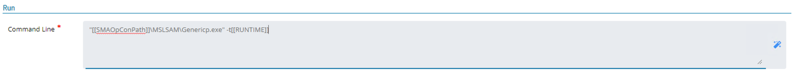
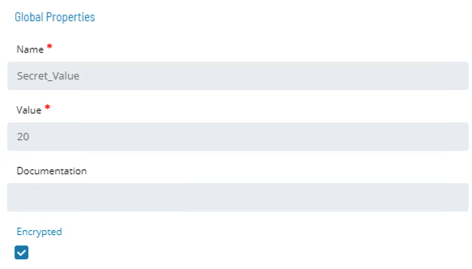
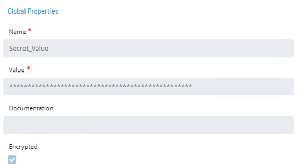
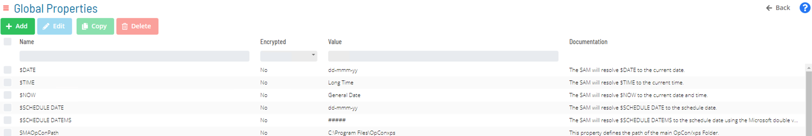
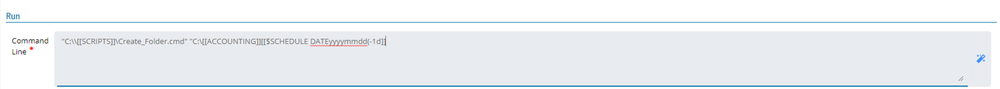

# Properties

* **Global Properties** are variables stored in the database that can be used throughout OpCon 
  * Properties are defined with a name and a value

:::tip Example
To use a Global Property in OpCon (Command Lines, Events, etc.) use the following notation:

```[[<Global Property Name>]]```

Example:

```[[PATH-TO-SCRIPTS]]```
:::

* OpCon will replace the Global Property with the given value at Runtime

* The **Global Properties** screen is used to manage OpCon Instance Properties that apply to the entire environment  

### Troubleshooting Global Properties

:::tip Example
* Job Stays On Hold
  * If SAM is unable to Resolve a Property, it will place the Job “On Hold” at Runtime
  * Both the SAM and Critical Logs will report which Property has an error
:::


### Encrypted Global Property


* The Value of a **Global Property** can be **Encrypted** by simply checking the **Encrypted** check box and saving the **Global Property**
* This value is decrypted by **LSAM** at Runtime
* **There is no decrypt option** 
* Good for things like passwords

* In Solution Manager, **Global Properties** is found in **Library > Administration > Global Properties**

### Add New Global Property


### Global Properties in Command Line



### Encrypted Global Properties





### System Properties

:::info
**Properties** are variables stored in the database that can be used throughout OpCon
* Defined with name and value
:::

* **Global Properties** (OpCon Instance Properties) are variables associated with the entire environment  
* **Job Instance Properties** are variables associated with a specific Job
* **Schedule Instance Properties** are variables associated with a specific Schedule
* **Machine Instance Properties** are variables associated with a specific Machine 

### System Properties vs User Defined Properties 

* All Global Properties that begin with a dollar symbol (```$```) are known as System Properties
* System Properties give variable values dependent on the System 
* Many of these system values can be format modified 
    * Example: ```$DATE``` can be set to ```mmddyy```, ```yyyymmdd```, ```mm```, etc. 
* ```$DATE``` is the current date of the OpCon server
    * ```$SCHEDULE DATE``` is the date a Schedule was built
        * If a Schedule is built for January 1st at 23:50, but runs until January 2nd at 3:30, all ```$SCHEDULE DATE``` properties will be resolved to January 1st date

### System Properties Offsets

* ```$DATE``` or ```$SCHEDULE DATE``` System Properties can be offset
* Example:
    * ```[[$DATEmmddyy(+1d)]]``` or ```[[$DATEmmddyy(-1d)]]``` for day offsets

* **Offset Day**
    * ```[[$DATEmmddyy(+1d)]]``` or ```[[$DATEmmddyy(-1d)]]``` for day offsets
* **Offset Working Day**
    * ```[[$SCHEDULE DATEmmddyy(+1wd)]]``` or ```[[$SCHEDULE DATEmmddyy(-1wd)]]``` for * Working Day offsets
        * ```$SCHEDULE DATE``` required for this Working Day offset
* **Offset Month**
    * ```[[$DATEmmddyy(+1m)]]``` or ```[[$DATEmmddyy(-1m)]]``` for day offsets
        * No offset specific for year – Use ```(+12m)``` or ```(-12m)``` to offset years
* **End of Month**
    * ```[[$DATEmmddyy(+1eom)]]``` Value finds the last day of current month
        * ```+1``` is current month 
        * ```+2``` is next month
    * ```[[$DATEmmddyy(-1eom)]]``` Value finds the last day of previous month

### Global Properties List



### System Properties in Command Line



### Job Instance Properties

* **Job Master** contains an **Instance Definition** tab for each individual Job where **Job Instance Properties** can be defined or modified
* Use of a Job Instance Property must contain "```JI.```" in front of the Property name (e.g., ```[[JI.Path]]```)
    * Identifies a Property as a Job Instance Property

### Schedule Instance Properties

* Use of a Schedule Instance Property must contain "```SI.```" in front of a Property name (e.g., ```[[SI.ID]]```)  
    * Identifies a Property as a Schedule Instance Property

#### Schedule Instance Definition

* Instance Definitions can be created or modified within the Schedule Build Wizard
    * Property names can be defined for single-instance Schedules
    * Named Instances can be selected or defined for multi-instance Schedules

### Machine Instance Properties

* Advanced Machine Properties screen is used to manage **Machine Instance Properties** of a specific Machine
* Use of a Machine Instance Property must contain "```MI.```" in front of a Property name (e.g., ```[[MI.LSAMpath]]```)  
* Identifies a Property as Machine Instance Property
* Communication to a Machine within OpCon must be Stopped to add or modify Machine Instance Properties

:::caution Warning
Machine Instance Properties are case sensitive
::::  

### Practice Activity

**<a href="practice-create-a-global-property" target="_blank">Create a Global Property</a>**

### For More Information

**[Properties Documentation](https://help.smatechnologies.com/opcon/core/objects/properties)**

**[Using Properties for Automation](https://help.smatechnologies.com/opcon/core/objects/using-properties)**

**[Defining Properties](https://help.smatechnologies.com/opcon/core/objects/defining-properties)**

**[Managing Global Properties Documentation](https://help.smatechnologies.com/opcon/core/Files/UI/Solution-Manager/Library/Managing-Global-Properties)**

