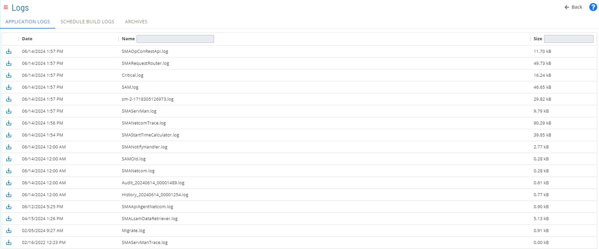
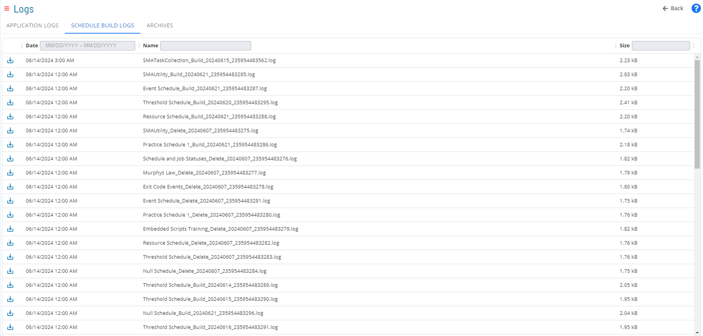
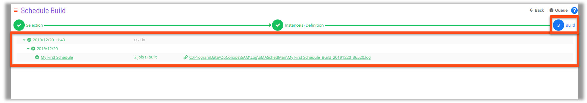
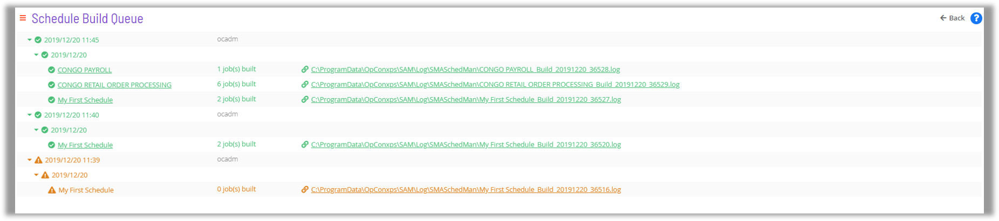
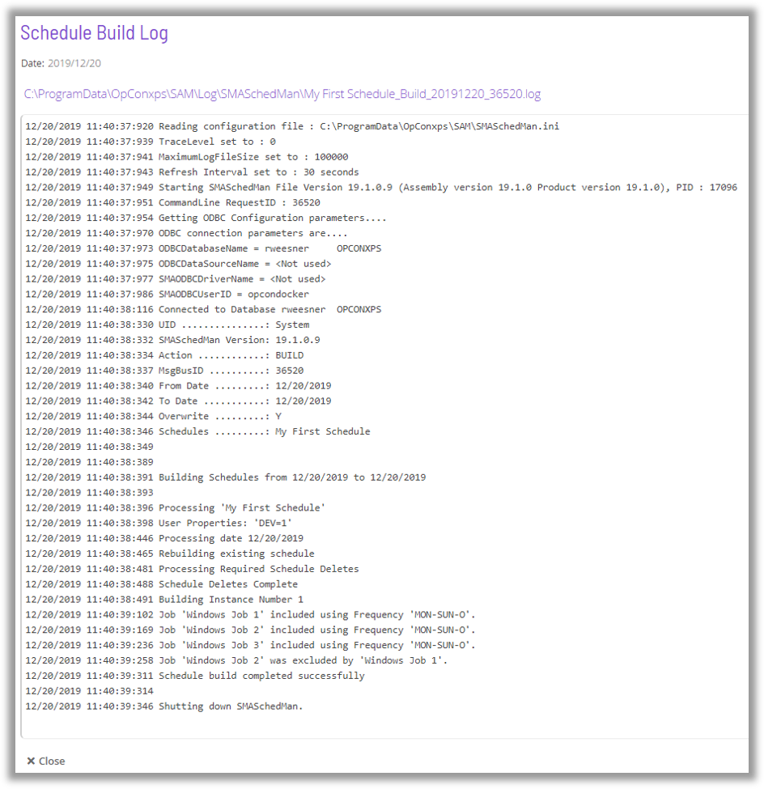
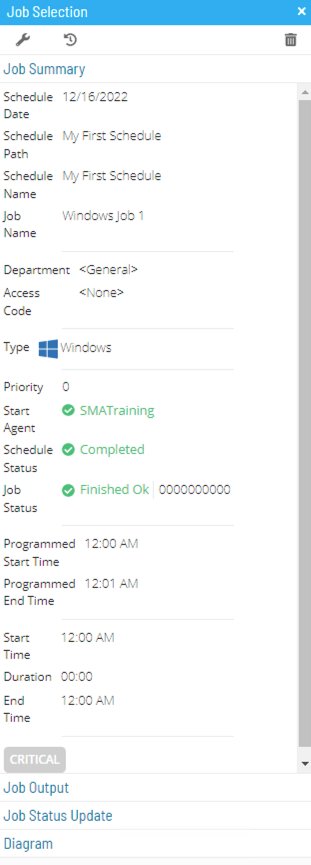
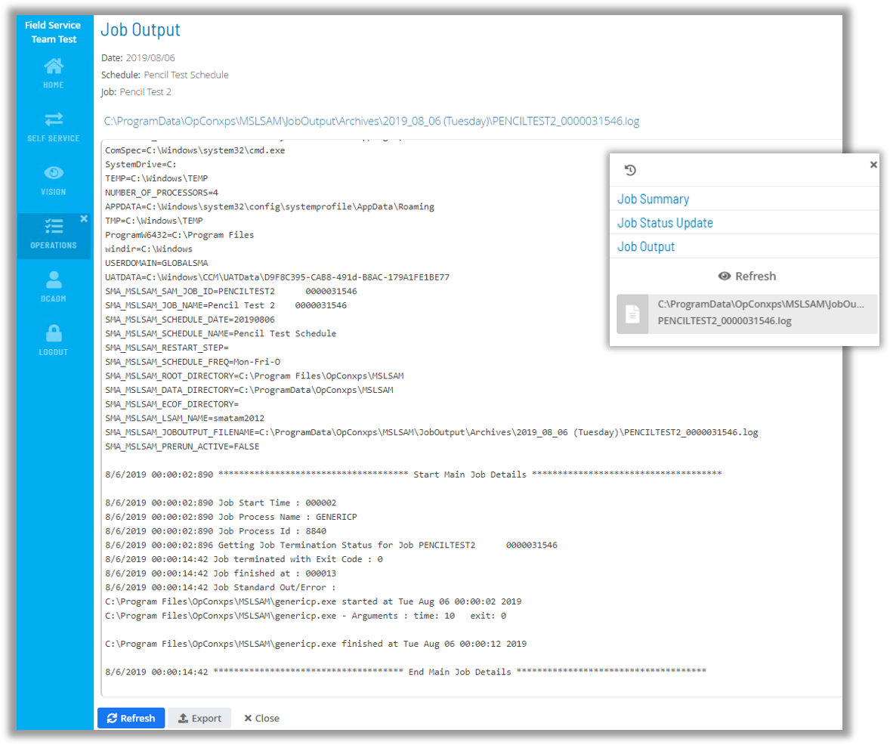
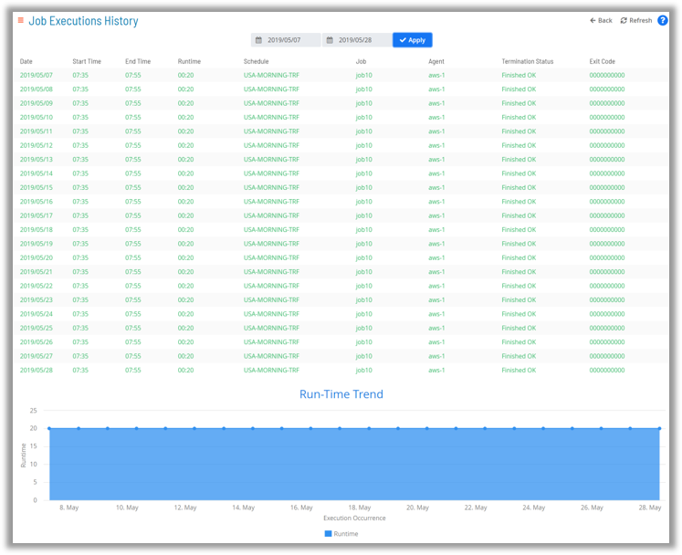
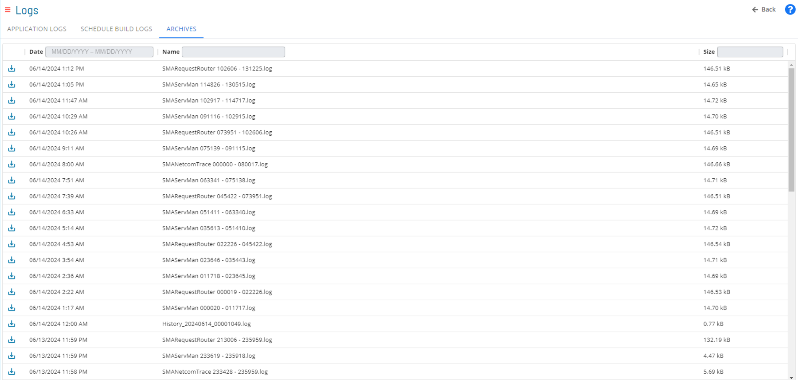

## Logs

### Application Logs

### Schedule Build Logs

#### Schedule Build Logs - from Schedule Build

* Schedule Build Logs (Schedman Logs) can be pulled directly from Schedule Build
  * Upon completion of a Schedule Build in Solution Manager a Job Status is created that includes a link to the Schedule Build Log file

### Job Summary

### Job Output

* The Job Output file can be accessed from the Job Summary tab

### Job History

* The Job Executions History Screen contains a Run-Time Trending Chart

* Job Output from previous runs can be retrieved

### Log Archives

### For More Information

[List Application Logs](https://help.smatechnologies.com/opcon/core/Files/UI/Solution-Manager/Library/Logs/List-Log-Files)****

**[List Schedule Build Logs](https://help.smatechnologies.com/opcon/core/Files/UI/Solution-Manager/Library/Logs/List-Schedule-Builds)**

**[List Archive Files](https://help.smatechnologies.com/opcon/core/Files/UI/Solution-Manager/Library/Logs/List-Archive-Files)**

**[Log File Details](https://help.smatechnologies.com/opcon/core/Files/UI/Solution-Manager/Library/Logs/Log-File-Details)**

