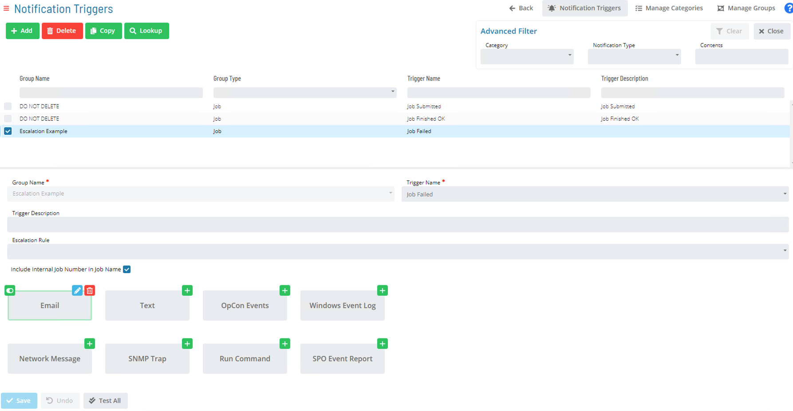
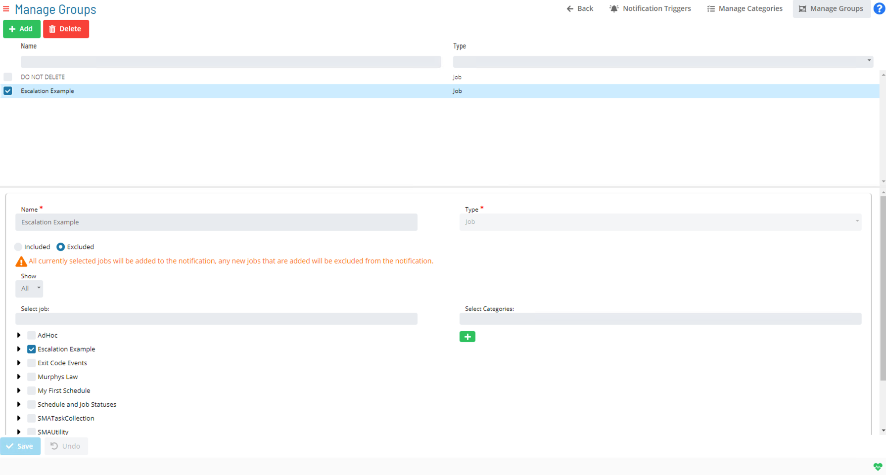

# Notification Manager

Event Notification in OpCon is a process in which Machine, Schedule, and Job status change events generate (i.e., trigger) notifications. For critical notifications, administrators can also apply escalation rules to provide higher visibility.

The basic types of notifications include Windows Event Log, Email (SMTP), Network Message, SNMP Trap, Unisys Single Point of Operations (SPO) AL and CO Reports, Text Messages (SMS), OpCon Events, and Command. With OpCon, notifications can be created in several ways.

### Creating Notifications in OpCon

* Create Notification Groups
* Create Notification Triggers
    * Define Notifications based on change events: 
        * Machine
        * Schedule
        * Job Status

### Notification Triggers Main Screen

### Add/Edit Trigger Output

### Manage Trigger Groups

### Notification Documentation

[Event Notification](https://help.smatechnologies.com/opcon/core/notifications/Components)

[Notification Triggers](https://help.smatechnologies.com/opcon/core/notifications/Notification-Triggers)

[Notification Configuration](https://help.smatechnologies.com/opcon/core/notifications/Notification-Configuration)

[Notification Categories](https://help.smatechnologies.com/opcon/core/Files/UI/Solution-Manager/Library/NotificationCategories/)

[Notification Groups](https://help.smatechnologies.com/opcon/core/Files/UI/Solution-Manager/Library/NotificationGroups/)

[Solution Manager - Notification Triggers](https://help.smatechnologies.com/opcon/core/Files/UI/Solution-Manager/Library/NotificationTriggers/)

### Practice

<a href="practice-notification-manager" target="_blank">Practice - Notification Manager</a>