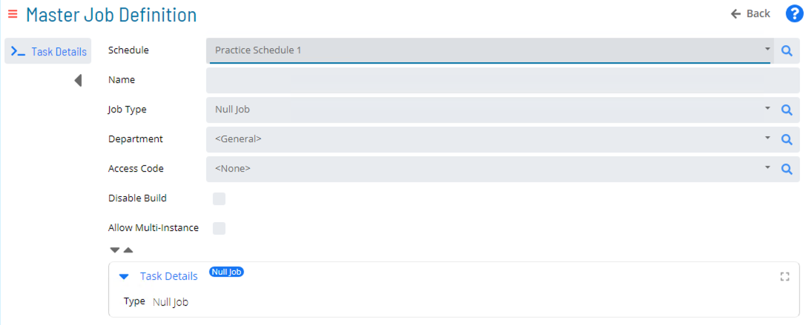

# Null Jobs

* Null Jobs simply finish OK at Runtime 
* Can be used to kick off Events or tie together workflows to a single point

### Null Job Task Details

### Practice Activity

**<a href="practice-create-a-null-job" target="_blank">Create a Null Job</a>**

### For More Information

The links below provide concept documentation for creating and using Null Jobs in OpCon.

**[Null Jobs](https://help.smatechnologies.com/opcon/core/automation-concepts/null-jobs)**

**[Null Job Details](https://help.smatechnologies.com/opcon/core/job-types/null)**

