# Operational Views

* In Solution Manager, Operations is found in the sidebar menu and Solution Manager Homepage.

### Operations Portal Buttons

### Operations Summary

### Daily Processes

* The Processes tab accesses Daily processes in operation
* Dates, Schedules, and Jobs can be selected by toggling for those selections
* Filter profiles can be created and modified

##### Select Date:  

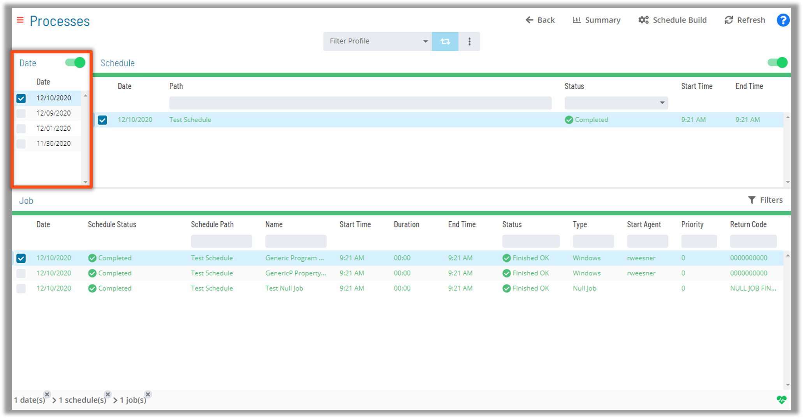

##### Select Schedule:    

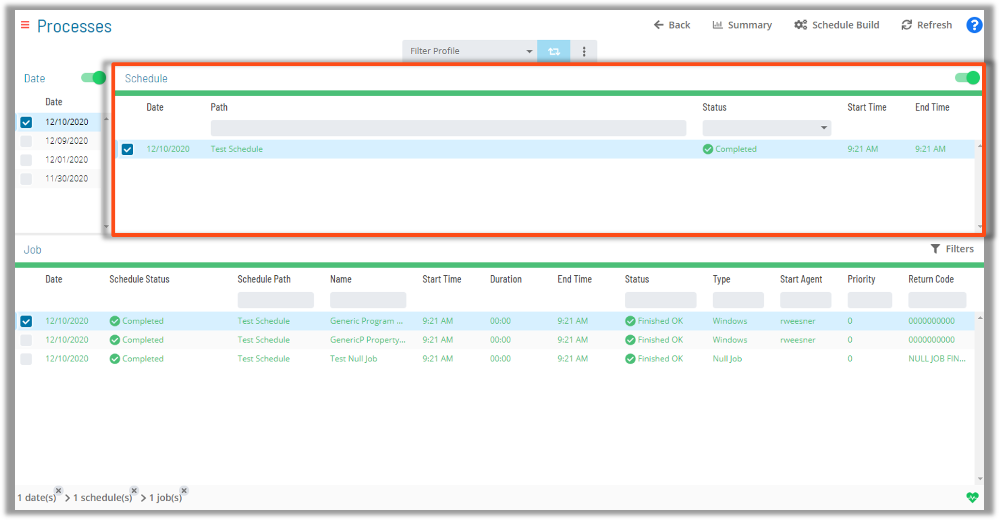

##### Select Jobs:    

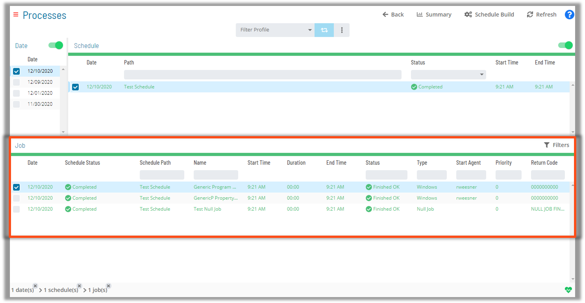

### Diagrams and Views

* In the Diagram option of the Job Selection tab the user can select several options to manipulate PERT view in Solution Manager:  
* Progressive Discovery    
  * A focused view of Dependency relationships  
* Isolate Dependency Chain View  
  * Displays the entire Dependency chain  
* Isolate Predecessors View  
  * Displays all preceding Jobs in a Dependency chain  
* Isolate Successors View  
  * Displays all subsequent Jobs in a Dependency chain  

#### Progressive Discovery View

* View Group Selections and Job Chains
* Isolate Dependency Chains, Predecessors, or Successors
* Job Status indicated by colors and icons 

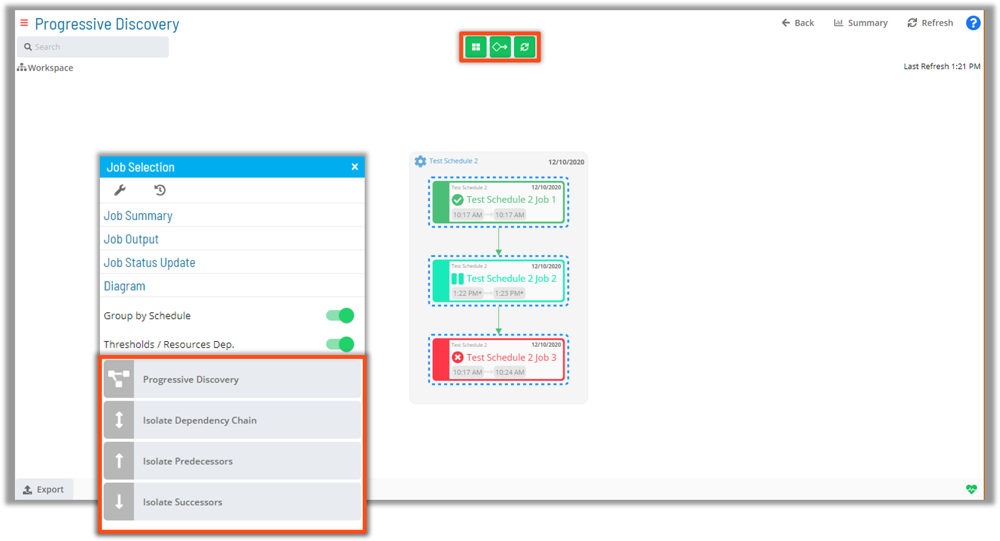

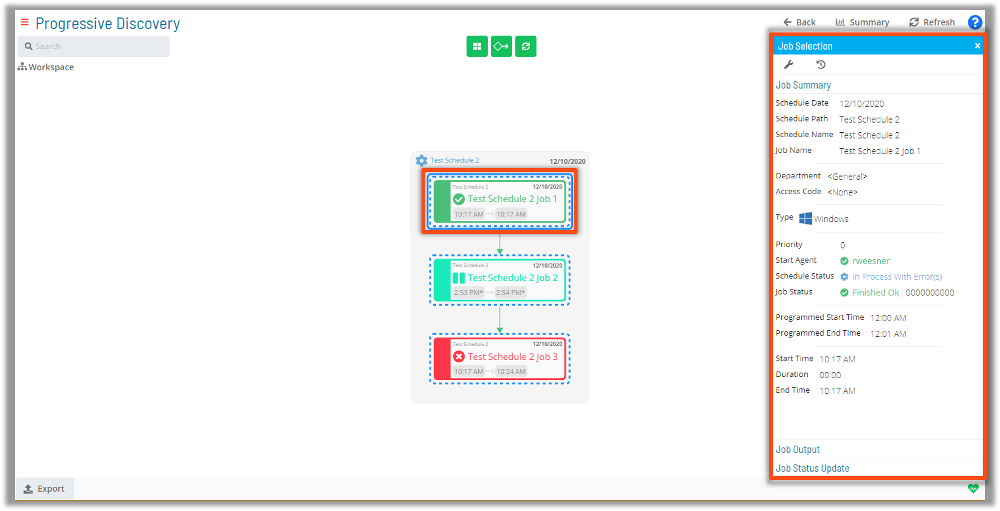

#### Bread Crumb Navigation

In addition to selecting processes through the primary Date, Schedule, and Job panes, Navigation is also simplified with the Bread Crumb Navigation bar at the bottom of the browser 

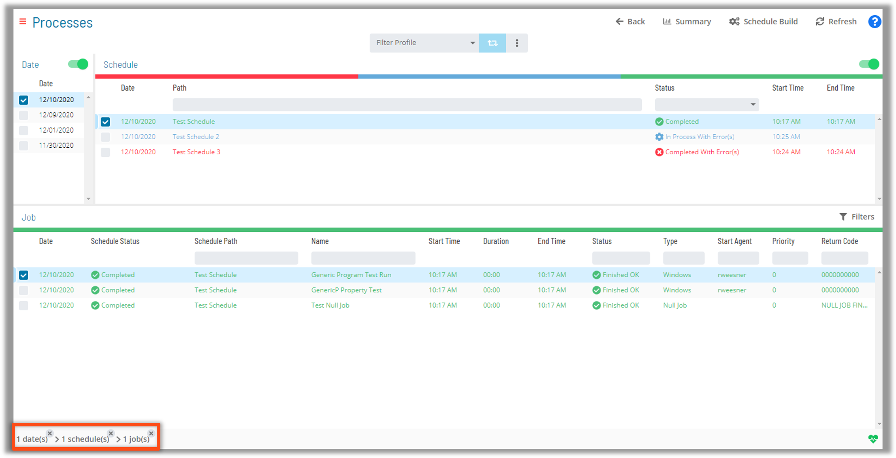

### Job Status and Selection Options

##### Filter by Job Status  

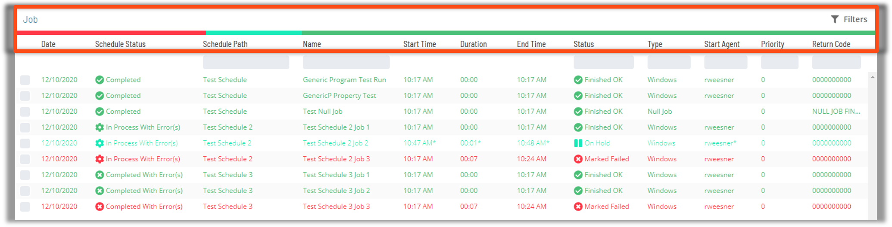

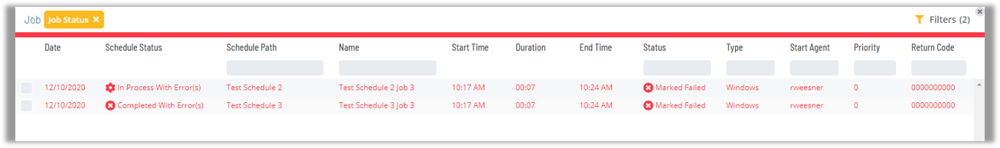

#### Scrolling Bulk-Selection

* Multiple Schedules and/or Jobs can be selected at once by left-clicking and dragging the mouse pointer through desired selections

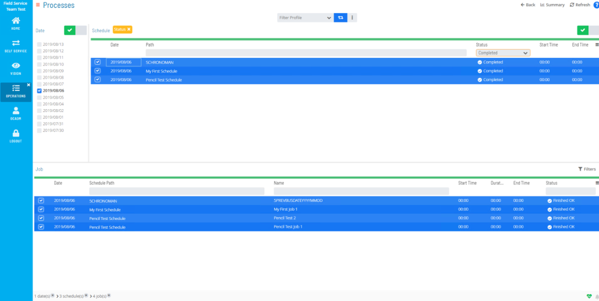

### Job Selection Options

When a Job is selected with a right-click several options are made available in a tab:

* Job Configuration Tool
* Job Executions History
* Job Summary
* Status Update
* Job Output
* Diagram

#### Job Summary

* Right-clicking on a selected Job will provide a detailed Job Summary Tab Screen  

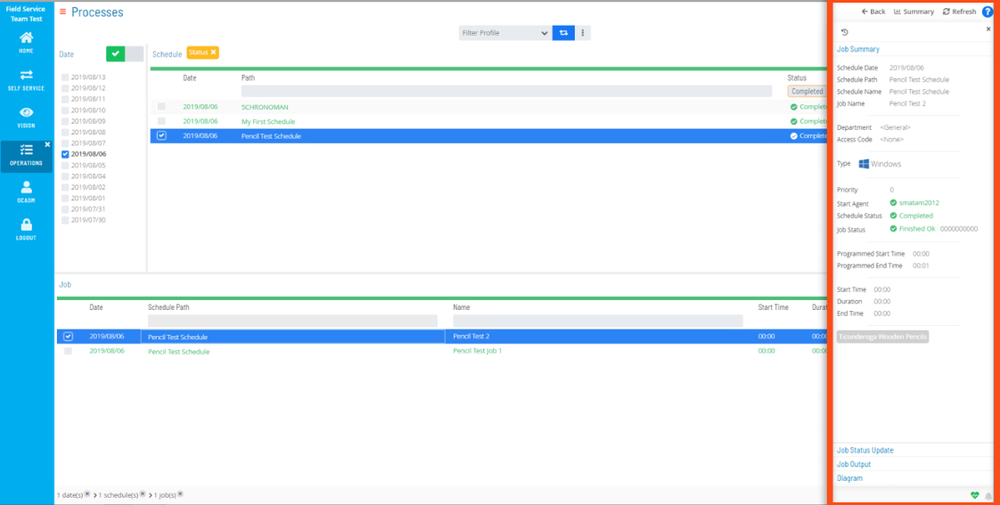

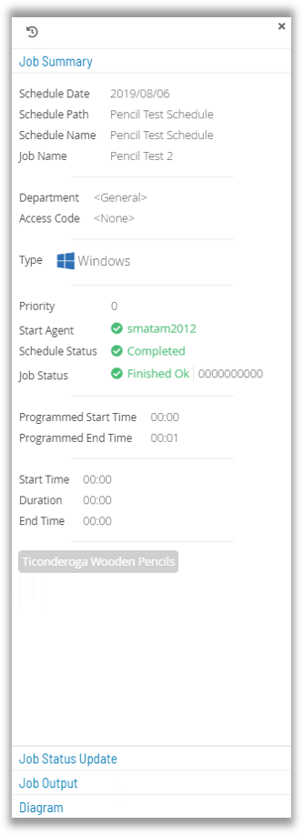

### Operations Documentation

[Operations - Daily Processes](https://help.smatechnologies.com/opcon/core/Files/UI/Solution-Manager/Managing-Daily-Processes)

[Operations - Managing Schedules](https://help.smatechnologies.com/opcon/core/Files/UI/Solution-Manager/Managing-Schedules)

[Operations - Agent Status Updates](https://help.smatechnologies.com/opcon/core/Files/UI/Solution-Manager/Performing-Agent-Status-Updates)

[Operations - PERT View](https://help.smatechnologies.com/opcon/core/Files/UI/Solution-Manager/Using-PERT-View)

[Operations - View Job Output](https://help.smatechnologies.com/opcon/core/Files/UI/Solution-Manager/Viewing-Job-Output)

[Operations - Accessing Job Summary](https://help.smatechnologies.com/opcon/core/Files/UI/Solution-Manager/Accessing-Job-Summary)

[Operations - Accessing Job Executions History](https://help.smatechnologies.com/opcon/core/Files/UI/Solution-Manager/Accessing-Job-Executions-History)