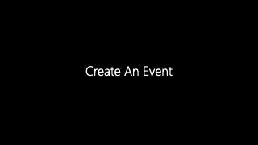

# Practice: Create An Event

### Objective

To use Events to cancel a job in a workflow when a preceding job finishes okay.

### Instructions

#### Create the Schedule

1.	In Solution Manager, from the **Home** tab, select **Studio**.   
2.	Click the **Add** button on the toolbar.   
3.	In the Schedule Name textbox, enter **Event Schedule**.   
4.	In the Documentation textbox, enter **This is a Training Schedule**.  
5.	In the **Schedule Build and Maintenance** frame, mark the **Auto Build** checkbox.  
6.	Set ```7``` for the number of days in advance for Auto Build.  
7.	Set ```1``` for the number of days to Auto Build.  
8.	Mark the **Auto Delete** checkbox.  
9.	Set ```7``` for the number of days to Auto Delete.  
10.	Click the Save button.   

#### Create the Jobs

1.	In Solution Manager, select **Studio**. 
2.	In the **Schedule List**, select **Event Schedule**.
3.	Click the **View** button in the toolbar.
4.	In the **Menu** to the right, select **Add Job**.
5.  In the **Name** textbox, enter **Event Job 1**
6.  In the **Job Type** drop-down list, select **Windows**.
7.  Expand the **Task Details** section to open the Details box.
8.	In the **Machine Selection** section, select the desired machine from the **Machines or Machine Group** drop down. 
9.	In the **General** section, select the desired user from the **User Id** drop down.
10.	Under the **Run** section, **type** the following in the **Command Line** box:
```cmd
timeout /t 10
```
11.	Click the **Save** button.
10. Click the **Lock** button in the upper right-hand corner.
11. Expand the **Frequency** box.
12. **Add** a frequency for a **Mon-Sun-O** pattern.
  * In the **Frequency Name** box, type **Mon-Sun-O**.
  * Set **When to Schedule** as **All Weeks**.
  * Select all days of the week by marking their check boxes.
  * Be sure that the **A/O/B/N** radio button is set to **On Date**.
  * Click the **Save** button.
13. Click the **Back** button to return to the **Job List**.
14. Using the filters at the top of the Job List, locate **Event Job 1** and **Copy** it twice, once for **Event Job 2** and once for **Event Job 3**. 

#### Create the Event

15. Using the filters at the top of the Job List, locate and select **Event Job 1**.
16. Click **Edit**.
17. Click the **Lock** icon to enter Admin Mode.
18. Locate and expand the **Events** section.
19. Click the **+** button.
20. In the **Create new Event** screen:
  * In the **Send Event On** dropdown, select **Job Status**.
  * In the **Job Status** dropdown, select **Finished OK**.
  * In the **Event Template** dropdown, select the **$JOB:CANCEL** event.
  * In the **Schedule Date** field, use the **Magic Wand** or **CTRL+SPACE** to enter in **$SCHEDULE DATE**.
  * In the **Schedule Name** field, use the **Magic Wand** or **CTRL+SPACE** to enter in **$SCHEDULE NAME**.
  * In the **Job Name** field, enter in the job name for **Event Job 3**.
  * Click **Save**.
21. Click **Save**.
22. Close **Library**.

:::info

For all events, you can use **System Properties** for fields like the **Schedule Date** and **Schedule Name**.
* For example: To use a ```$JOB:CANCEL,<Schedule date>,<Schedule name>,<Job name>``` event, you can substitute the following for the appropriate fields:   
  * ```<Schedule date>``` can be replaced with either ```CURRENT```, ```[[$DATE]]```, or ```[[$SCHEDULE DATE]]```  
  * ```<Schedule name>``` needs to be replaced with either the **full name of the Schedule the Job is in** or ```[[$SCHEDULE NAME]]```  
  * ```<Job name>``` needs to be replaced with **the name of the Job this Event is going to cancel**
:::

#### Add Dependencies

23. Open **Studio**.
24. Select **Event Schedule**.
25. Click **View**.
26. Click **Event Job 3**.
27. In the side menu, select **Add Dependency**.
28. In the **Job Dependency** pop-up, select **Event Job 2** in the **Job** drop down list.
29. Verify that the **Dependency Type** is **Requires** and the **Condition** is **Finished OK**.
30. Click the **Save** button.
31. Repeat **Steps 26-30** to add a dependency between **Event Job 1** and **Event Job 2**.
32. Close **Studio**.

#### Build the Schedule

33. In **Operations**, select **Schedule Build**.
34. In the **Schedule Date** section, validate that today's date is specified for both **From** and **To**.
35. In the **Schedule Build** section, click the **Released** radio button.
36. Toggle on **Overwrite Existing Schedules**.
37. In the **Schedule Selection** list, select **Event Schedule**.
38. Click the **Build** button.
39. Expand and click on the schedule link for **Event Schedule** to return to the Processes screen.
40. Verify that the Event processed in **Event Job 1** has successfully ***Cancelled*** **Event Job 3**.


### Video Walkthrough

[](https://sma1980-my.sharepoint.com/:v:/g/personal/rweesner_smatechnologies_com/EcdBcMJOuilCuJnyAdmwPkgBd3hLtfQR2C10emhe4bdTpw?e=XFtipp&nav=eyJyZWZlcnJhbEluZm8iOnsicmVmZXJyYWxBcHAiOiJTdHJlYW1XZWJBcHAiLCJyZWZlcnJhbFZpZXciOiJTaGFyZURpYWxvZy1MaW5rIiwicmVmZXJyYWxBcHBQbGF0Zm9ybSI6IldlYiIsInJlZmVycmFsTW9kZSI6InZpZXcifX0%3D)