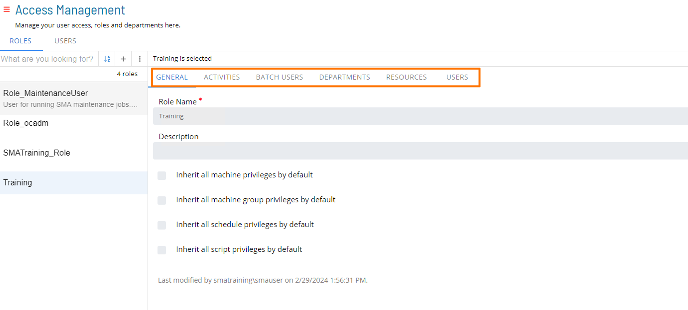
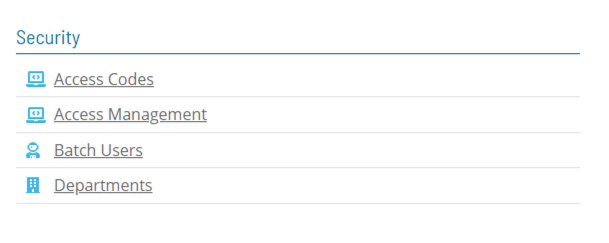
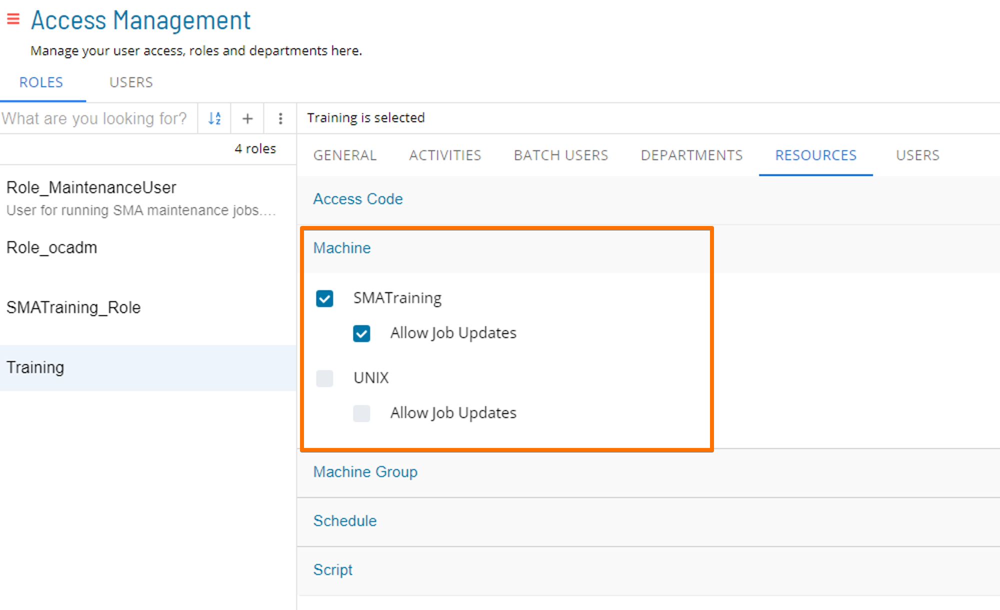
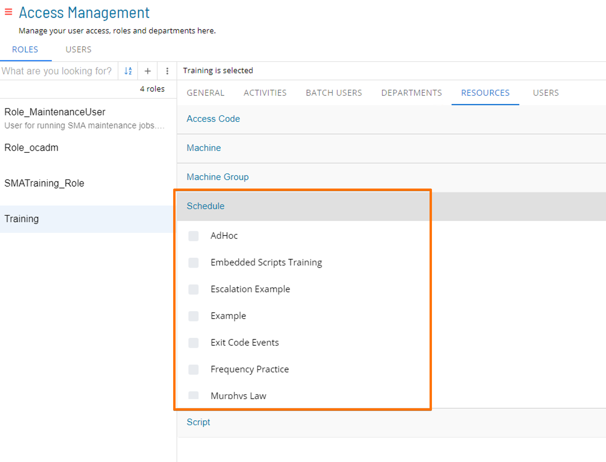
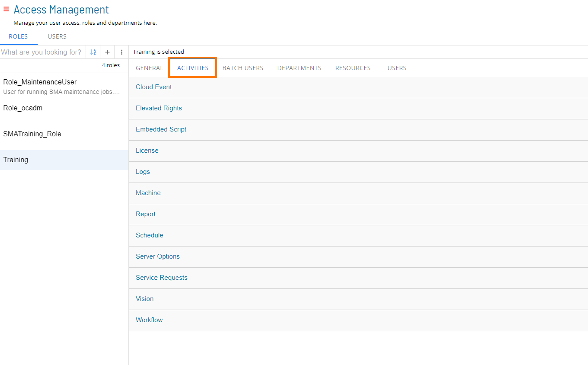

# Privileges

### Privileges

* The Administrator can grant a variety of Privileges to Roles using the Role Definition sections on the Role page:
  * General
  * Activities
  * Batch Users
  * Departments
  * Resources

* Machines and Machine Groups are maintained using the **Agents** table.
* Access Codes, Batch Users, and Departments are created on corresponding screens within **Security** section of the **Library**

### Machine Privileges

* Machine Privileges are used to control Machines for Users in a Role that have Privileges to create and edit Jobs
* Within Master Job and Operations, Users will only see Machines based on their Role Privileges
* In Schedule Operations, Machine Privileges are not applied

### Schedule Privileges

* Removes/Grants Privileges to specific Schedules
* In order to view a Schedule, each OpCon user must be granted access
    * If a User does not have access to see a Schedule, that User would never know it exists
* If a User creates a Schedule, that User is automatically granted access

### Function Privileges

* Individual Privileges inside ‘Function Privileges’ are used to grant access to Functions not related to Jobs
* Each User must have Function Privileges via one or more Roles to perform actions within OpCon

### For More Information

**[Privileges](https://help.smatechnologies.com/opcon/core/administration/privileges)**

**[Access Management](https://help.smatechnologies.com/opcon/core/Files/UI/Solution-Manager/Library/AccessManagement/Access-Management)**

**[Managing Privileges](https://help.smatechnologies.com/opcon/core/Files/UI/Solution-Manager/Library/AccessManagement/Roles/Managing-Roles-And-Privileges)**