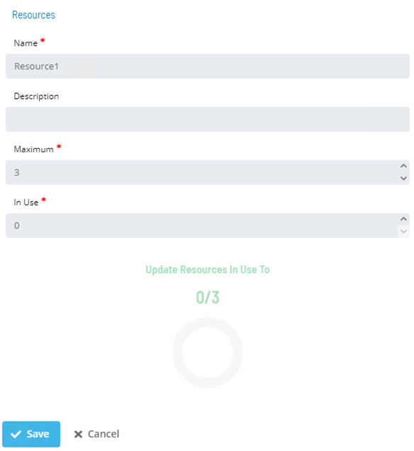
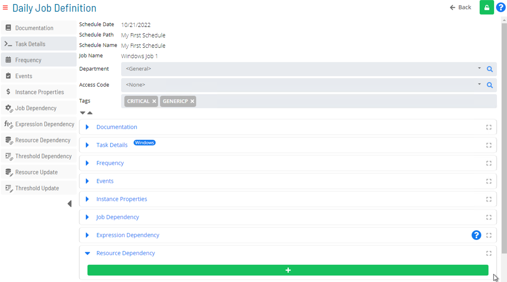
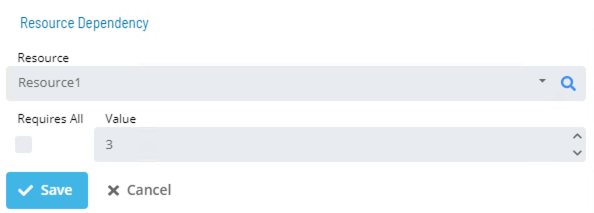
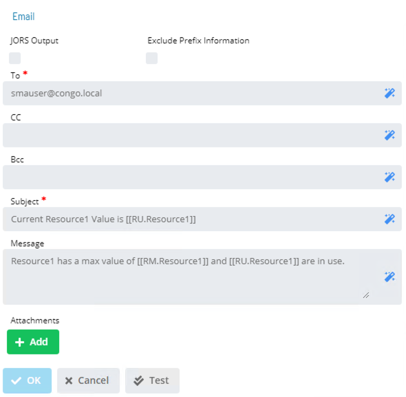

# Resources

* **Resource**: user-defined value consisting of name and numeric limit
* Resources are used to manage and limit the number of concurrently running Jobs across Schedules and Machines in OpCon
* **Max Concurrent Jobs** in Advanced Machine Properties limits the number of concurrently running Jobs on a specific Machine

	* **All** Resources can be set for Dependencies  
	* SAM is responsible for keeping track of Resources in use

:::info Note

If all Resources are in use, SAM waits until a Resource is available before submitting the next Job

:::

## Solution Manager

* In Solution Manager, **Resources** is found in **Library > Administration > Resources**


### Create/Edit Resource



### Resource Dependencies in Job Details



### Edit/Set Resource Dependency



### Trigger Email Alert of Resource Properties




### Frequency - SAM Priority

* Used if Max Concurrent of the following two features is met:
	* Machine has reached Max Jobs limit (Windows and UNIX defaults are ```50```)
	* A Resource has all Resources in use
* The Job with highest **SAM Priority** will run first if several Jobs are waiting for a Resource or a Machine Max Job to free up


### Practice Activity

**<a href="practice-create-a-resource" target="_blank">Create a Resource</a>**

### For More Information

**[OpCon Objects - Resources](https://help.smatechnologies.com/opcon/core/objects/resources)**

**[Threshold/Resource Updates](https://help.smatechnologies.com/opcon/core/job-components/threshold-resource-updates)**

**[Treshold/Resource Dependencies](https://help.smatechnologies.com/opcon/core/job-components/threshold-resource-dependencies)**

**[Solution Manager - Resources](https://help.smatechnologies.com/opcon/core/Files/UI/Solution-Manager/Library/Resources/)**


