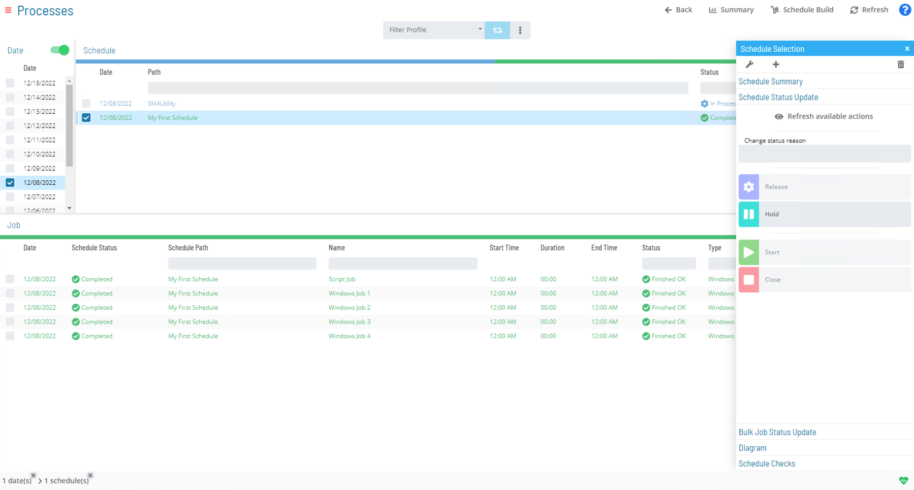
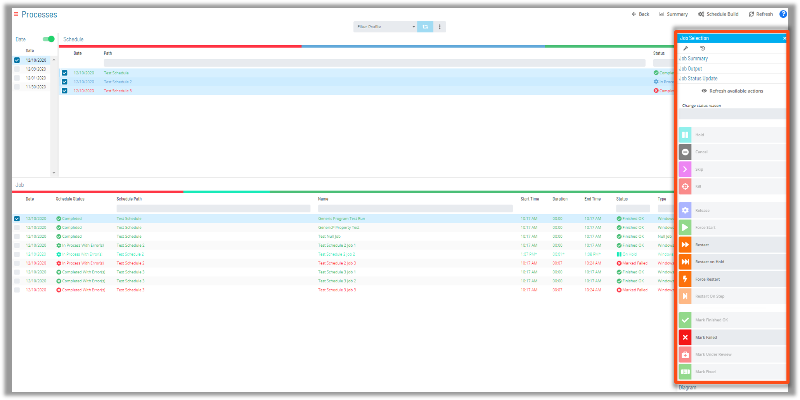

# Schedule and Job Status

### Schedule Status

* Possible Schedule statuses:
  * Wait to Start
  * On Hold
  * In Process
  * Completed
  * Completed–Contains Failed Jobs 
  * In Process-Contains Failed Jobs

### Job Status

Jobs have many different statuses 

* Some common Job statuses include:
  * Qualifying
  * Wait to Start
  * Time
  * Dependency
  * Thresholds/Resources
  * Machine
  * Running
  * Finished OK
  * Marked Finished OK 
  * Failed
  * Marked Failed
  * On Hold
  * Cancelled
  * Skipped (or Job to be Skipped)
  * Under Review 
  * Fixed

### Schedule Status Screen

### Job Status Screen

Right-Click Jobs and available actions appear

* If Multiple Jobs are selected, Actions on those Jobs can occur at once selected 

### For More Information

**[Schedule Status Changes](https://help.smatechnologies.com/opcon/core/Files/UI/Solution-Manager/Performing-Schedule-Status-Changes)**

**[Job Status Changes](https://help.smatechnologies.com/opcon/core/Files/UI/Solution-Manager/Performing-Job-Status-Changes)**

**[Bulk Job Status Updates](https://help.smatechnologies.com/opcon/core/Files/UI/Solution-Manager/Performing-Bulk-Job-Status-Updates-Schedule-Level)**