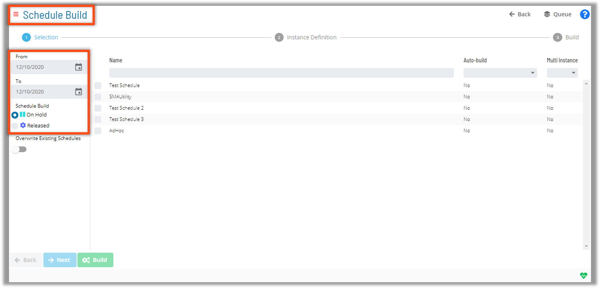
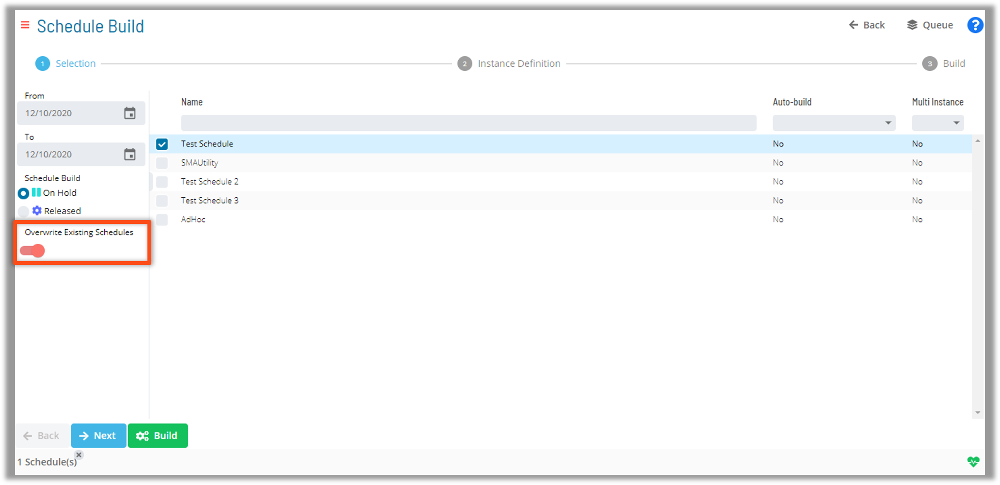

# Schedule Build

* OpCon (SAM) will search the database for Schedules and Jobs that must run on a specific date
  * Based on information stored in Master tables, SAM will add Schedules and Jobs to Daily tables
* Schedules can be built manually or automatically

### Auto Build

* Auto building **X days in advance** is the starting day to build on
* Auto building **for Y days** is how far out to build
* OpCon builds Schedules automatically at midnight (by default)
* Best Practice for Autobuild is **7 days in advance for 1 day**
 
  * Example: ```7``` days in advance for 1 day will build on the 7th counted day in the future (the first counted day is Day ```0```)


  * Example: ```0``` days in advance for ```7``` days will build **daily** for ```7``` days (the first counted day is Day ```0```)


### Manual Build

* The **Build** button on the Operations Summary Page activates the Schedule Build Wizard
* The Selection page allows the user to choose a Master Schedule to build with multiple options:
  * Date Range Selection
  * On Hold or Release Status
  * Overwrite Existing Schedules Option
* Users can also filter Schedules with Auto-build or Multi-Instance configurations





### Schedule Build Grouping

* Multiple Builds can be bundled and tracked as a group
* The bundle can be expanded to view and monitor the status of each Build

### Schedule Build Documentation

[Building Daily Schedules](https://help.smatechnologies.com/opcon/core/operations/building-schedules)

[Schedule Build Log](https://help.smatechnologies.com/opcon/core/Files/UI/Solution-Manager/Managing-Schedules#schedule-build-log)


### Practice

<a href="practice-build-a-schedule" target="_blank">Practice - Build a Schedule</a>