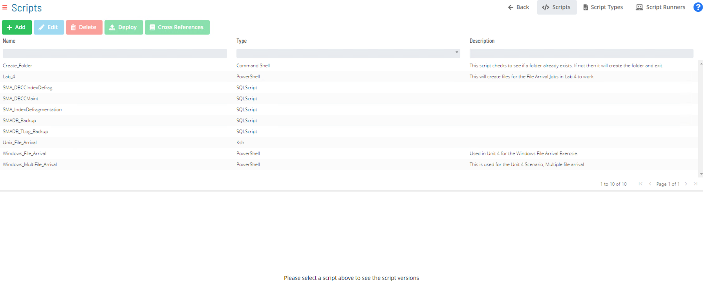
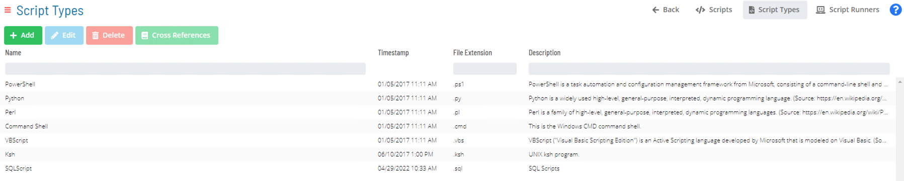
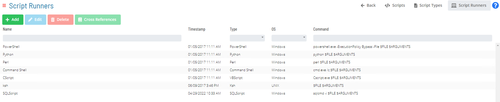
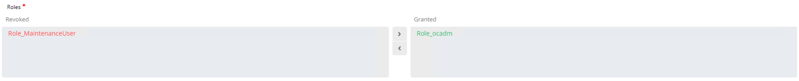
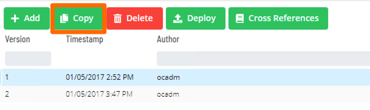
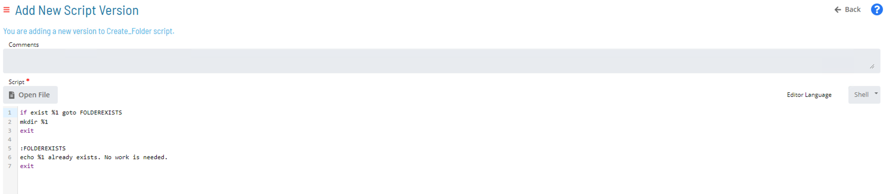
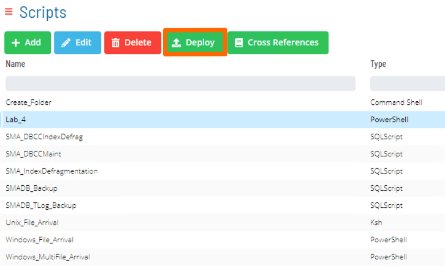
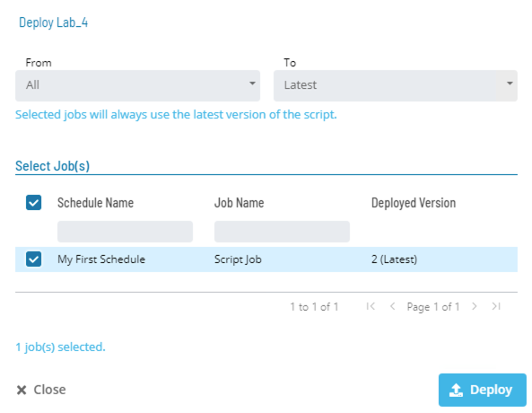
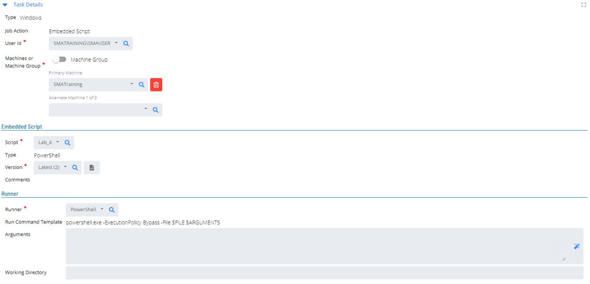

# Embedded Scripts

* OpCon has ability to push Scripts from the OpCon database to Windows and UNIX environments
* The OpCon Database acts as a centralized Repository that is replicated with database
* The Repository allows for Version Control



#### Four part make up Embedded Scripts

* Script Types
* Script Runners
* Script Repository
* Job Master

### Script Types

* Configure type of Scripts which can be stored by OpCon
* *There are 6 **predefined** Script types, but more can be added*
  * Command Shell (.cmd)
  * Perl (.ps)
  * PowerShell (.ps1)
  * Python (.py)
  * VBScript (.vbs)
  8 SQL (.sql)



### Script Runners

* Script Runners define Command Line created to run Script
* Allows more than one Script runner per Script Type

:::tip Example
* Powershell would include ```“–ExecutionPolicy Bypass and –File”``` before command, so the Script Runner would look like: ```powershell.exe -ExecutionPolicy Bypass -File $FILE $ARGUMENTS```.
:::



### Script Repository

* Where Scripts are created and stored
* Previous versions are accessible


#### Required Fields

* **Name** – Defines Name of Script (No spaces allowed in Name)
* **Description** – Documents purpose of Script
* **Open File** - Allows loading of Script from network
* **Blank Text Field** – Create Script 
* **Type** – Specifies Script Type 
* **Initial Comments** – Documents differences between Script versions

#### Assign a Role to a New Script

* A Role must be assigned when a Script is created or imported to the Script Repository



#### Edit a Script

* In the Repository, a **Copy** of the script must be made before you can **Edit** it.





#### Deploy Script

* Multiple jobs can run differnt versions of the same Embedded script.
* To have all jobs run the same version, one needs to **Deploy** that version to the jobs.





#### Script Cross References

* Cross Reference in the Repository allows one to see all the jobs that are running the same script.


:::warning
A Script with Cross References cannot be deleted
:::

### Embedded Script Job



* **Job Action** – Change from Run Program to Embedded Scripts
* **Script** – Specifies which script to call
* **Script Type** – Specifies Script Type for Selected Script
* **Runner** – Script Runner for Selected Script
* **Run Command Template** – Contents of Script Runner
* **Version** – Specifies Script Version selected
* **Arguments** – Enter the parameter(s) passed to Script (if needed)
* **Working Dir.** – Working Directory (starting directory) for Script

### Scripts Documentation

[Embedded Scripts](https://help.smatechnologies.com/opcon/core/automation-concepts/embedded-scripts)

[Managing Scripts](https://help.smatechnologies.com/opcon/core/Files/UI/Solution-Manager/Library/Scripts/Managing-Scripts)

[Managing Script Versions](https://help.smatechnologies.com/opcon/core/Files/UI/Solution-Manager/Library/Scripts/Managing-Script-Versions)

[Managing Script Types](https://help.smatechnologies.com/opcon/core/Files/UI/Solution-Manager/Library/Scripts/Managing-Script-Types)

[Managing Script Runners](https://help.smatechnologies.com/opcon/core/Files/UI/Solution-Manager/Library/Scripts/Managing-Script-Runners)

### Practice

<a href="practice-scripts" target="_blank">Practice - Embedded Scripts</a>