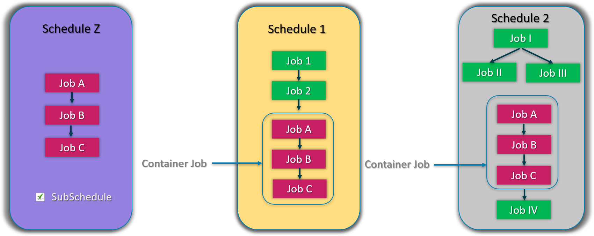
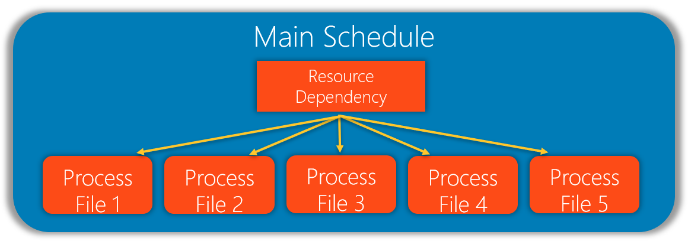
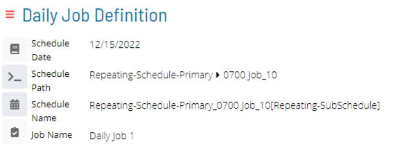
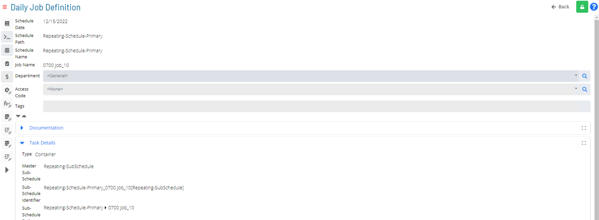
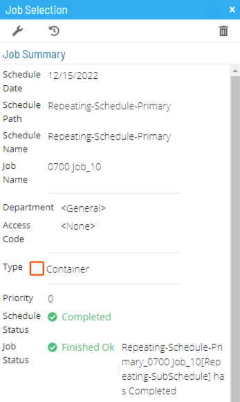

# SubSchedules and Container Jobs

### SubSchedule: Definition

* Schedule which can be embedded in another Schedule (or other Schedules)
	* Only built if called by a Container Job
	* Give Job-like properties to Schedules
* Are Multi-Instance by default
	* Can duplicate blocks of Jobs from a shared Resource

### SubSchedule Visualization

### Container Job: Definition

* Job that contains Sub-Schedule
* Grants SubSchedule all Job-like properties
	* Frequencies 
    :::tip
    **Remember**: Container Jobs are **JOBS**. Jobs need Frequencies to run!
    :::
	* Time Offsets (Other Frequency Details)
	* Dependencies
	* Events
	* Etc.
* Multiple Container Jobs can reference same SubSchedule
* Container Job will only Complete if all Jobs in SubSchedule have completed

### SubSchedule/Container Job: Setup

* Create SubSchedule:
	* Create Schedule in Schedule Master
	* Mark Schedule as **SubSchedule**
* Embed SubSchedule within another Schedule by creating Container Job
	* Create Job using Container Job Type
	* Select SubSchedule that the Container Job will use

### SubSchedule Usage Scenarios

### Scenario 1 - Multiple Runs/SubSchedule

* Same 5 Job processes needs to run exact same way 4 times each day
	* Instead of Looping Jobs or Events, use **SubSchedules**

### Scenario 2 - Concurrent Processes

* 5 files need to be processed by arrival time
* No order for when each file needs to be processed
* Same set of jobs will process the files
* Files need to be processed one at a time

### Scenario 3 - Daily and Monthly Process

* Daily Schedule has 5 processes that must run every working day
* If it is end of month, instead of running these 5 processes, Monthly Schedule, with 7 processes, must run **excluding** execution of Daily Schedule

### Scenario 3 - Daily and Monthly Process Solution

* Create Schedule with 2 SubSchedules
	* Daily SubSchedule with 5 jobs
	* Monthly SubSchedule with 7 jobs
	* Main Schedule will have both SubSchedules as Container jobs
	* Monthly Schedule has **Excludes Dependency** on Daily SubSchedule
    
:::note
This solution simplifies Frequencies definitions
:::

### Container Job Schedule Path in Job Definition

### Container Job Task Details

### Container Job Details in Job Summary

### Practice Activity

**<a href="practice-subschedules" target="_blank">SubSchedules</a>**

### For More Information

**[SubSchedules and Container Jobs](https://help.smatechnologies.com/opcon/core/operations/containers)**

**[Container Job Type](https://help.smatechnologies.com/opcon/core/job-types/container)**

**[Viewing SubSchedules in Canvas](https://help.smatechnologies.com/opcon/core/Files/UI/Solution-Manager/Studio/Canvas/Viewing-Master-Schedules/#subschedules)**

**[SubSchedule Names](https://help.smatechnologies.com/opcon/core/operations/schedule-names#subschedules)**
