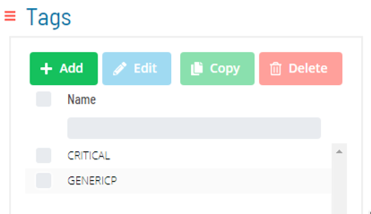
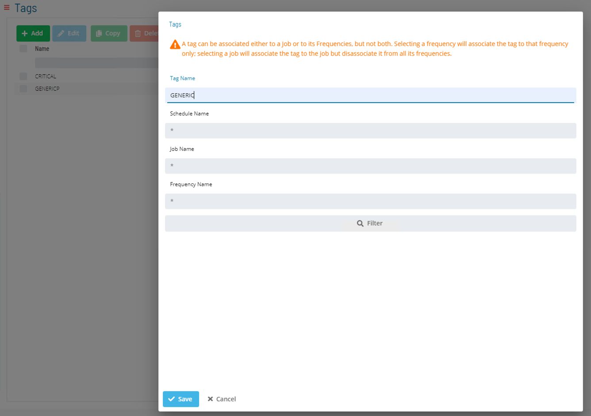

# Tags

* Tags are labels assigned to Jobs 
  * Allow filtered Operations views
  * Do not affect the way Jobs will run 

* In Solution Manager, **Tag Management** is found in **Library > Management > Tags**

### Tag Manager/Add a Job Tag

#### Select Add to Create a New Tag 

#### Enter a Tag Name

#### Select Jobs to Tag

### Tag Documentation

[Tag Concept Documentation](https://help.smatechnologies.com/opcon/core/job-components/tags)

### Practice

<a href="practice-create-a-tag" target="_blank">Practice - Create a Tag</a>