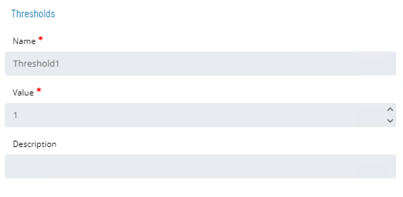
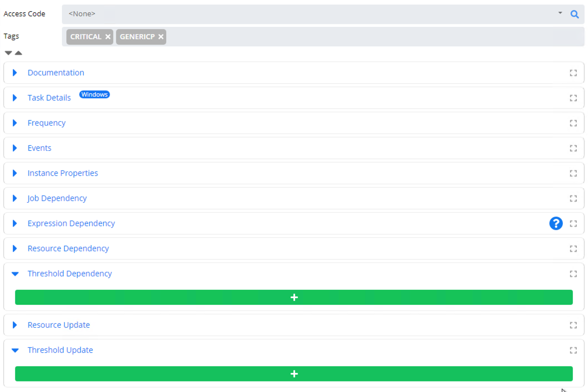
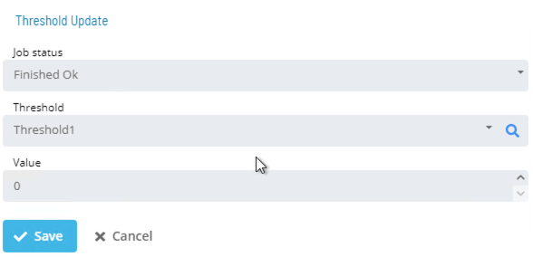
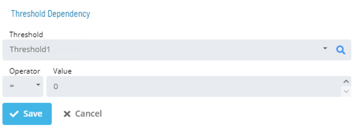
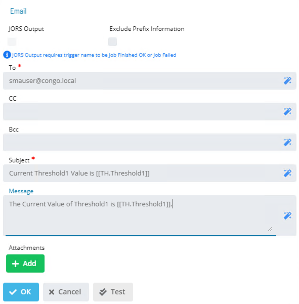
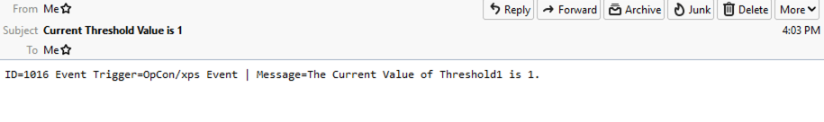

# Thresholds

* User-defined placeholder 
* Consists of a name and a numeric value 
* Help resolve dependencies that cannot be resolved by Job Dependency 
	* (i.e. – A specification can be made for a Job to not start until a Threshold condition is met)

### Usage

* Create a Threshold
* Assign Threshold Dependencies
* Create a trigger updating Threshold
* Reset Threshold to initial value once complete

### Threshold Dependencies

* The Threshold/Resource Dependency tab allows the definition and maintenance of Job Dependencies on Threshold and Resource values 
	* A Threshold can be used to start a Job after a certain value is reached

* In Solution Manager, **Thresholds** is found in **Library > Administration > Thresholds**

### Create/Edit Threshold



#### Threshold Options in Job Details



### Threshold Update



#### Threshold Dependencies



#### Threshold Instance Properties

* Current value of Threshold can be retrieved: ```[[TH.ThresholdName]]```

#### Threshold Email Alerts






### Practice Activity

**<a href="practice-create-a-threshold" target="_blank">Create a Threshold</a>**

### For More Information

**[OpCon Objects - Thresholds](https://help.smatechnologies.com/opcon/core/objects/thresholds)**

**[Threshold/Resource Updates](https://help.smatechnologies.com/opcon/core/job-components/threshold-resource-updates)**

**[Treshold/Resource Dependencies](https://help.smatechnologies.com/opcon/core/job-components/threshold-resource-dependencies)**

**[Solution Manager - Thresholds](https://help.smatechnologies.com/opcon/core/Files/UI/Solution-Manager/Library/Thresholds/)**


